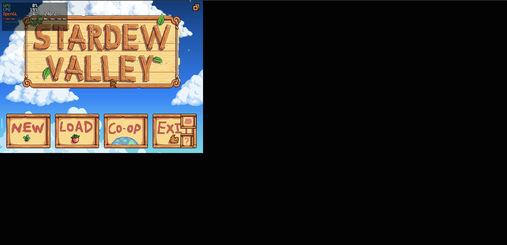
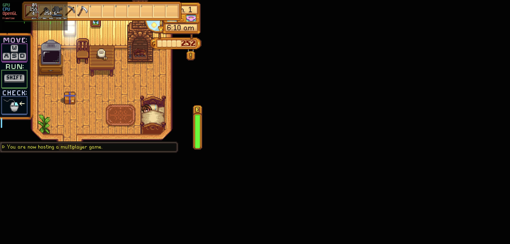
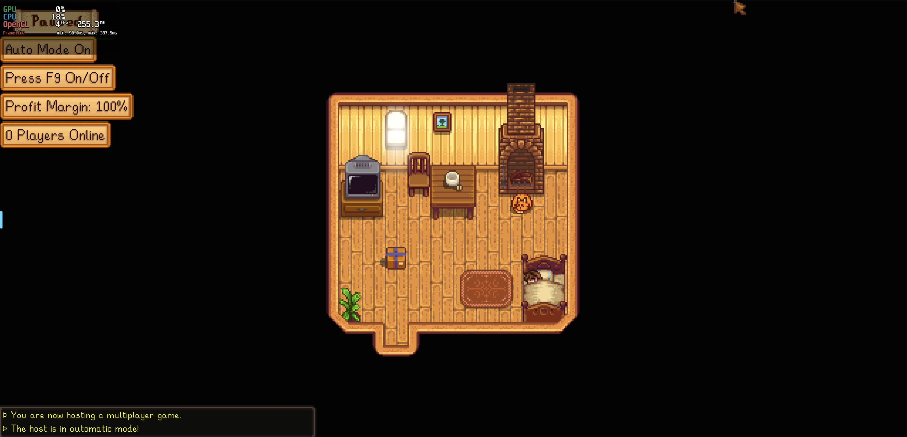

[](https://github.com/DaanSelen/stardew-multiplayer/actions/workflows/docker.yml)
[](https://github.com/DaanSelen/stardew-multiplayer/actions/workflows/codeql.yml)

# Stardew Valley Multiplayer Server (Docker)

The reason I made this adaptation is because I saw that the code in the other repositories are becoming quite old.<br>
In particular the Debian version, at the moment was 10, which is slowly becoming deprecated.<br>
But less-efficient code was also one of the factors.<br>

Therefor this project, it tries to modernize the packages with the same functionality.

# Overview:

This container setup has a couple things to know. First off you need to get the game files yourself. I cannot legally present them here.<br>
Furthermore you'll have to know that this server exposes at least 1 port, and at most 3 ports for a succesful server.<br>
These are:

```
- 24642/udp # This is the Stardew Valley Server port
- 3000/tcp  # This is the raw-VNC port. For remote connections
- 3001/tcp  # This is the web-VNC port. For remote commections through a web-browser.
```

Steps to get it running:

1. Package the game files.
2. Build the container.
3. Run the container.
4. Go to the (web)-VNC port and access the server.
5. Create a world and prepare for multiplayer.
6. Once its done, you can join the server.

# Getting the game files.

Getting the game files is arguably the hardest part. I love this game, and I do recommend buying it for yourself.<br>
Have fun!<br>

For indication on how to package the game yourself look at this document: [Packaging Guide](./guides/packaging.md).

# Where are the mods?

If you can't find the mods in here, or not all the mods for a smooth server. Look at the following lines.

Due to the permissions and rights, I am not allowed to give to you the mods directly from here, on Github.

Therefor you have to download the mods according to: [Downloading Mods](./guides/mods.md)

# Building the image:

Once you clone this repository you can build the image using the following command:<br>
Note that you need to package the game yourself, als place it with the correct name in the local root of the repo.
```sh
docker build (-f ./Dockerfile) . -t stardew-server:latest
```
If you want to integrate the building directory into the compose, you can use the following:
```yaml
services:
  stardew:
    restart: unless-stopped
    container_name: stardew-server
    build:
      context: .
      dockerfile: ./Dockerfile
    ports:
      - "3001:3001/tcp"
      - "24642:24642/udp"
    volumes:
      - config:/config
      - saves:/config/.config/StardewValley/Saves
volumes:
  config:
  saves:
```
This compose creates the image from the source code once you type `docker compose up -d` with the -d meaning detached (in the background).<br>
For GPU support refer to the following docs:<br>

- https://docs.linuxserver.io/images/docker-webtop/#dri3-gpu-acceleration-kasmvnc-interface
- https://docs.linuxserver.io/images/docker-webtop/#nvidia-gpu-support-kasmvnc-interface

# How to set the server up for the first time:

Once you get the container running, which you can check like this:

```shell
docker compose up -d # This will make it run
docker ps            # This will show the running containers
```

```
CONTAINER ID   IMAGE                         COMMAND                  CREATED         STATUS          PORTS                                                                                                    NAMES
b3996663dd16   stardew-multiplayer-stardew   "/init"                  9 seconds ago   Up 8 seconds    3000/tcp, 0.0.0.0:3001->3001/tcp, [::]:3001->3001/tcp, 0.0.0.0:24642->24642/udp, [::]:24642->24642/udp   stardew-server
```

Once you see this, you can check the web-VNC (on port 3001/tcp):

> The password is set inside the ENV variables of the container.

This presents a login pop-up where you need to fill in those credentials.


Then you are on the main menu.


You have to create your world and once you are setup:


Then the last thing you need to do is restart the docker container.
```shell
docker restart stardew-server # Or your server name
```


And as seen above you have a couple rows displaying you are hosting a Multiplayer game!<br>
Good luck.

# Extra tips

If you are having trouble with the low fps inside the VNC and can't get the world created - then:<br>
Go to the assets folder and edit MongoHud.conf - change the `fps_limit` to something usable (or comment it out entirely).<br>
After that rebuild the image, set up your world and then after you've done that and the AutoLoadGame mod has kicked in<br>
Change it back to the low value to preserve the CPU utilization.

# RESOURCE USAGE:


# CREDITS:

Inspired by:<br>
- [Printfucks Version](https://github.com/printfuck/stardew-multiplayer-docker)

Mods:<br>
- [Always On Server For Multiplayer](https://github.com/perkmi/Always-On-Server-for-Multiplayer)<br>
- [Automate](https://www.nexusmods.com/stardewvalley/mods/1063)<br>
- [Auto Load Game](https://www.nexusmods.com/stardewvalley/mods/2509)<br>
- [Default On Cheats](https://www.nexusmods.com/stardewvalley/mods/21035)<br>
- [Multi-User Chests](https://www.nexusmods.com/stardewvalley/mods/9856)<br>
- [No Fence Decay Redux](https://www.nexusmods.com/stardewvalley/mods/20802)<br>
- [Non Destructive NPCs](https://forums.stardewvalley.net/threads/unofficial-mod-updates.2096/page-132#post-121034)<br>
- [Skip Intro](https://www.nexusmods.com/stardewvalley/mods/533)<br>
- [Unlimited Players](https://www.nexusmods.com/stardewvalley/mods/2213)<br>

Kind Regards.

And here an example of a succesful run:

```text
[custom-init] No custom services found, skipping...
[migrations] started
[migrations] no migrations found
usermod: no changes
───────────────────────────────────────

      ██╗     ███████╗██╗ ██████╗
      ██║     ██╔════╝██║██╔═══██╗
      ██║     ███████╗██║██║   ██║
      ██║     ╚════██║██║██║   ██║
      ███████╗███████║██║╚██████╔╝
      ╚══════╝╚══════╝╚═╝ ╚═════╝

   Brought to you by linuxserver.io
───────────────────────────────────────

To support LSIO projects visit:
https://www.linuxserver.io/donate/

───────────────────────────────────────
GID/UID
───────────────────────────────────────

User UID:    911
User GID:    911
───────────────────────────────────────
[custom-init] Files found, executing
[custom-init] 00-configure-i3.sh: executing...
'/etc/i3/config' -> '/config/.config/i3/config'
[custom-init] 00-configure-i3.sh: exited 0
[custom-init] 10-stardew.sh: executing...
'/data/stardewvalley/Mods/AutoLoadGame/config.json' -> '/config/modconfs/autoload/config.json'
'/data/stardewvalley/Mods/Always On Server/config.json' -> '/config/modconfs/always_on_server/config.json'
Starting...
Launching Stardew Valley in the background...
Entering Stardew Launching Function...
[custom-init] 10-stardew.sh: exited 0
Sleeping for 5 seconds to give the DE some breathing time...
[custom-init] 20-tail-smapi.sh: executing...
Starting to follow the SMAPI logs (main process)...
[custom-init] 20-tail-smapi.sh: exited 0
Removing old logs if they exist...
SMAPI logs are not yet here. waiting 3 seconds...
_XSERVTransmkdir: ERROR: euid != 0,directory /tmp/.X11-unix will not be created.

Xvnc KasmVNC 1.3.3 - built May 31 2025 19:03:06
Copyright (C) 1999-2018 KasmVNC Team and many others (see README.me)
See http://kasmweb.com for information on KasmVNC.
Underlying X server release 12101007

[ls.io-init] done.
[mi] mieq: warning: overriding existing handler (nil) with 0x64a73e3cf290 for event 2
[mi] mieq: warning: overriding existing handler (nil) with 0x64a73e3cf290 for event 3
19
Executing Stardew/SMAPI Binaries!
SMAPI logs are not yet here. waiting 3 seconds...
/usr/bin/xterm
[16:30:51 INFO  SMAPI] SMAPI 4.2.1 with Stardew Valley 1.6.15 build 24356 on Unix 6.6.87.1
[16:30:51 INFO  SMAPI] Mods go here: /data/stardewvalley/Mods
[16:30:51 TRACE SMAPI] Log started at 2025-06-06T14:30:51 UTC
[16:30:57 DEBUG SMAPI] Waiting for game to launch...
[16:31:00 TRACE game] Instance_Initialize() finished, elapsed = '00:00:02.5540054'
[16:31:01 DEBUG SMAPI] Loading mod metadata...
[16:31:01 DEBUG SMAPI] Loading mods...
<SNAP>
MORE TEXT BUT NOT RELEVANT
```
